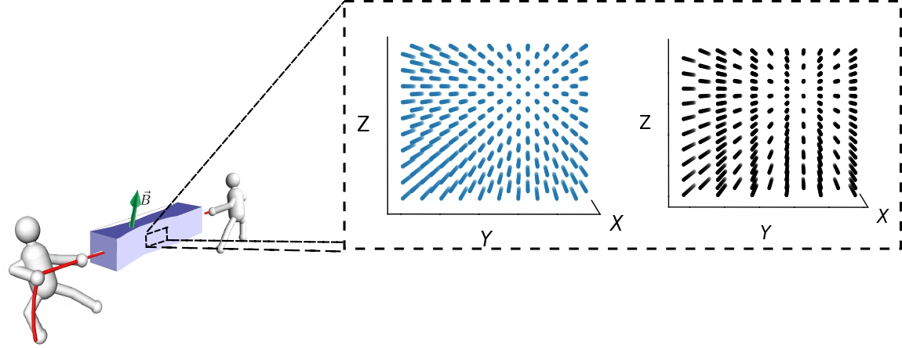

# Bienvenido
En esta página encontrarás una breve introducción a los semimetales de Weyl. Dichos materiales han ganado polularidad en el campo de la Ciencia de los Materiales y de la Física de Altas Energías, pues exhiben electrones que de manera colectiva se comportan como partículas relativistas sin masa, conocidas como fermiones de Weyl. 

